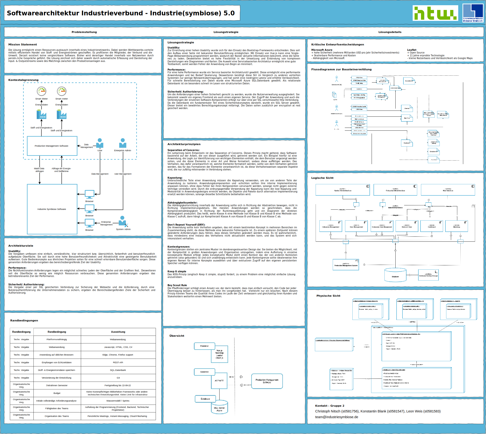
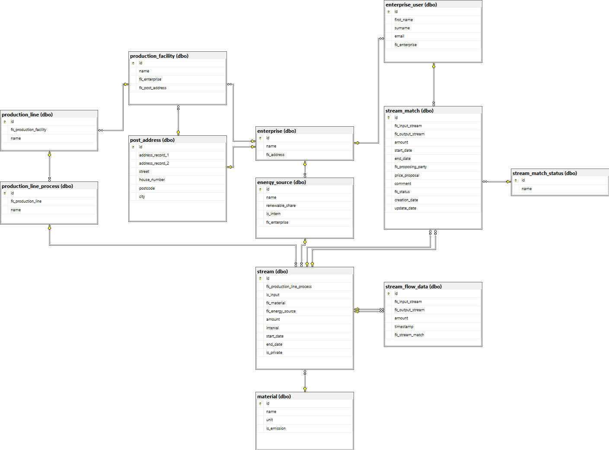

# Industry-Symbiosis: Resource Trading for Industrial Networks

A prototype platform developed for a university seminar, designed to help reduce resource waste efficiently.

## About The Project

This solution enables resource trading within an industrial network by repurposing production waste. Competitive advantages are created through the efficient trading of material and energy flows, which benefits members, the network, and the environment. 

Typically, such trading within networks relies on manual networking and personal discussions. Our solution stands out by providing:
* APIs for automatic material and energy flow recording.
* Clear displays of input and output streams.
* Automated matching between production facilities.

## Repositories & Live Demo

* **Backend (This Repository):** Contains the API and database setup. Currently hosted on Azure.
    * [Live API Demo (Get All Enterprises)](https://enterprisemanagementservice2.azurewebsites.net/api/enterprises/get/all)
* **Frontend:** The user interface is currently under development. 
    * [Frontend GitHub Repository](https://github.com/KonstantinBlank/Industry-Symbiosis-Frontend)

## Architecture & Database

**Architecture Poster (German):**

**Entity Relationship Model (ERM):**

---

## Tech Stack
* **Framework:** ASP.NET Core (C#)
* **Database:** Azure SQL
* **Cloud Hosting:** Azure (Azure App Service)
* **IDE:** Visual Studio 2022

